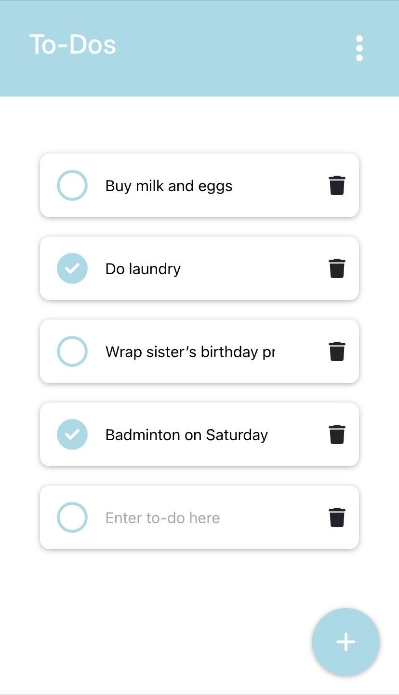
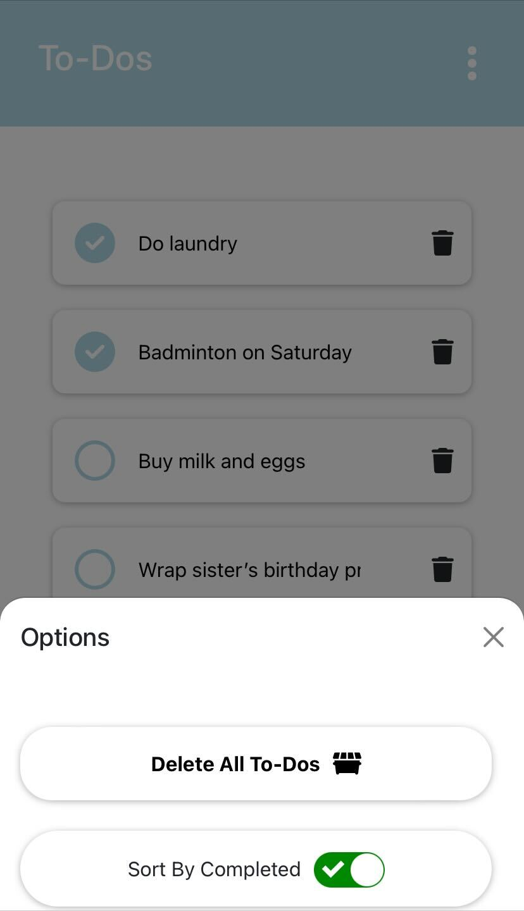

# To-Do List App
A web-based To-Do List App List written in React which can save and order list items which persist between browser sessions.

<div align='center' >
  
  
</div>

## Table of Contents

- [Installation](#installation)
- [Usage](#usage)
- [License](https://github.com/cyprste2717218/To-Do-List-App?tab=MIT-1-ov-file)

## Prequisites

- React 18.x or higher
- XO 0.56.x or higher

## Installation

1). Clone the repository:

```git clone https://github.com/cyprste2717218/To-Do-List-App.git```

```cd To-Do-List-App```

```npm install```

```npm start```

## Usage

To use the To-Do-List app, simply:

- Press the plus button on the bottom of the screen to add a To-Do, which will appear below the last one added

- Edit a To-do by pressing on the text box for the To-do to change it's text, or press the radiobox to enable it true or false

- Sort the To-Dos by completion status by using the bottom left checkbox, or delete all To-dos by pressing the button in the bottom left. <br>
You can also delete individual To-Dos by pressing the bin icon next to any To-Do


**Note:** 
Make sure no other application is utilising localStorage browser API during use, otherwise the app will experience runtime errors.
If the app doesn't load try clearing the browser's local storage by running ```localStorage.clear()``` in your browser's console
